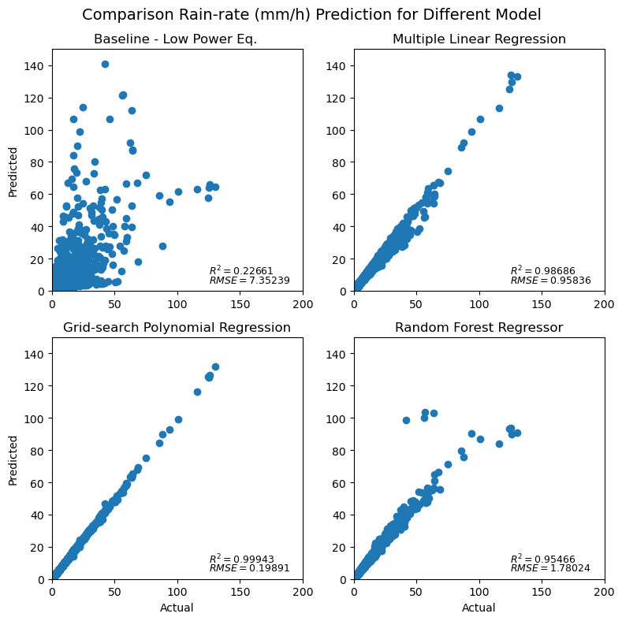

# ATMS 523 Weather and Climate Data Analytics 

## Module 5: Machine Learning Pt. 1

In this module we will learn specifically learn how to build machine learning models using python package of  `sklearn`

For this module there are 5 problems that need to be solved. Dataset for this module is polarimetric radar parameter retrieved from disdrometer measurement in Huntsville, Alabama. The radar dataset comprised of several variables hown below:
- `Zh` - radar reflecivity (dBz)
- `Zdr`- differential reflectivity 
- `Ldr` - linear depolarization ratio
- `Kdp` - specific differential phase
- `Ah` - specific attenuation
- `Adp` - differential attenuation
- `R` - rain rate (mm/h)

Basically, in this module we need to predict rain rate using different approach (baseline, multiple linear regression, grid-search polynomial regression, and random forest regressor), and then compare it with the calculated rain rate data using `pytmatrix` (already in the rawdata).

### 1. Prepare and split dataset into data training and data set

If we talk about building model based on machine learning, the most-taking time is about data preparation. In this step we need to make sure that our data is 'good' enough to be trained. Thus before use the data sometimes we need to know what can be used as data features and target, especially for supervised type. Thus, for this first problem I need to check the data and see the statistical data by using `describe` function. Others may us `seaborn` package to visualize all the data. In this data preparation we also need to remove `nan` data so that our trained model can be more robust. 

However, in this problem we need to calculate rain rate using power-low equation, or called as Baseline model by using

$Z = 200R^{1.6}$ where $dBz = 10log_{10}(Z)$

After that we need to split the dataset into train and test data with portion of 70:30. It should be noted that the features only consist of the original parameters except rain rate. 

Here, I also calculated the $R^2$ and RMSE of baseline model. 

### 2. Build and evaluate multiple linear regression model 

To solve this problem I simply build model using package from `sklearn` called `LinearRegression`. This model consumed least computation-time among other employed machine learning model as it uses simple linear regression without any additional setting. 

### 3. Grid-search polynomial orders with cross-validation

For this problem, we were being asked to search which polynomial model that could be best fit to the train data. It also required us to have 7 fold cross validation. Originally, the problem asked us to find the fitted polynomial within 21-order. Yet, both my local computer and Keeling could not handle it because of memory restriction. After several test, I finally got the result with 10 polynomial orders. 

Funny thing is the most-fitted polynomial model with the trained data located in the second-order. TBH, I already got it when I tried with 3-degree polynomial, but since I was not sure I tried my best to hit as many as my computer could. But yes, the most probable degree that my local computer can handle was 10 with computation time was about 58 mins. 

### 4. Random forest regressoor with cross-validation 

The last supervised machine learning that we need to build is random forest regressor. For this model, there are several hyperparamter that we need to set, and then find the best one to be fitted with our trained data. 
Here are the detils for hyperparameter option that we need to set on our model: 

- `n_estimators_list` = [200, 400, 600, 800, 1000, 1200, 1400, 1600, 1800, 2000]
- `max_features_list` = ['auto', 'sqrt']
- `max_depth_list` = [10, 20, 30, 40, 50, 60, 70, 80, 90, 100, None]
- `min_samples_split_list` = [2, 5, 10]
- `min_samples_leaf_list` = [1, 2, 4]
- `bootstrap_list` = [True, False]

It took my local computer 1h 51 mins to build a model with those required hyperparameters, and the best hyperparameter lied on this setting: 

- `n_estimators`: 200
- `min_samples_split`: 2
- `min_samples_leaf`: 1
- `max_features`: 'auto'
- `max_depth`: 50
- `bootstrap`: True

### Result 

#### Conclusion

The best model to predict rain rate using the provided features based on $R^2$ and RMSE is grid-search polynomial with degree 2. This model outperform for both $R^2$ and RMSE statistical value. It also less consumed computation time than random forest progressor. 

### Good Luck and Happy Sharing :sunglasses: 

### Reference :page_facing_up: 
- [Python Data Science Handbook](https://github.com/jakevdp/PythonDataScienceHandbook)
- [sklearn](https://scikit-learn.org/stable/)

#### Copyright :mega: 

Full code can be found on here: [machine learning part 1](https://github.com/atmsillinois/machine-learning-1-fsari2/blob/main/HW05_Fitria.ipynb)
